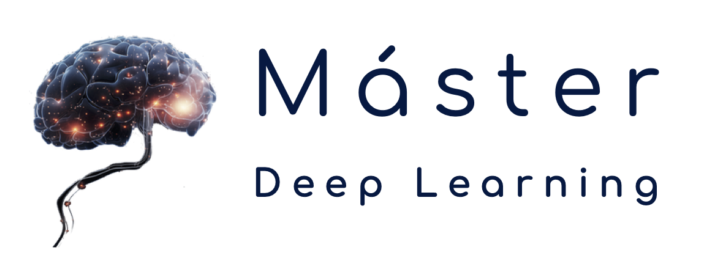

# Deep Learning para series temporales
Máster en Deep Learning UPM | Universidad Politécnica de Madrid | Curso 2024-25

 
 
 
 

[Español](#español) | [English](#english)

---

## Español

Este repositorio contiene el material para el curso **Deep Learning para series temporales (DLTEMP)**, del Máster en Deep Learning UPM por la Universidad Politécnica de Madrid (Curso 2024-25).

### Índice
- [Contenido del repositorio](#contenido-del-repositorio)
- [Contenido de la asignatura](#contenido-de-la-asignatura)

### Contenido del repositorio
- `nbs`: Contiene cuadernos Jupyter con ejemplos prácticos sobre algoritmos enseñados en el curso.
- `exercises`: Incluye cuadernos Jupyter con ejercicios semanales.
- `slides`: Contiene las diapositivas del curso.

### Contenido de la asignatura
| **Parte** | **Título**                         | **Contenido**                                                              | **Diapositivas**                                                                                                      | **Jupyter Notebook**                                                                                                  |
|-----------|------------------------------------|-----------------------------------------------------------------------------|----------------------------------------------------------------------------------------------------------------------|-----------------------------------------------------------------------------------------------------------------------|
| **I**     | Introducción                       | ¿De qué trata este curso? ¿Qué son las series temporales y para qué se usan?| [Diapositivas](./slides/01_introduction.pdf)                                                             | [Notebook - Ejercicios](./exercises/01_Introduction.ipynb) - [Notebook - Sesion guiada](./nbs/01_Introducction/01_Introduction.ipynb)                                                            |
| **II**    | Preprocesamiento y Análisis        | Preprocesamiento de series temporales y análisis exploratorio básico.      |                                                                                                                       | [Notebook - Ejercicios](./exercises/02_preprocessing_exercise.ipynb)                                                  |
| **III**   | Clasificación                      | Etiquetado de series temporales.                                           |                                                                                                                       |                                                                                                                       |
| **IV**    | Segmentación y Agrupamiento        | Identificación de comportamientos a largo plazo en series temporales.      |                                                                                                                       |                                                                                                                       |
| **V**     | Predicción                         | Estimación de lo que puede ocurrir en el futuro utilizando Deep Learning.  |                                                                                                                       |                                                                                                                       |
| **VI**    | Otras Tareas de Deep Learning      | Exploración de otros posibles usos de Deep Learning en series temporales.  |                                                                                                                       |                                                                                                                       |

[Volver al índice](#índice)  | [Inicio](#)

---

## English

This repository contains the material for the course **"Deep Learning para series temporales" (DLTEMP)** of the Master in Deep Learning UPM by Polytechnic University of Madrid (Course 2024-25).

### Index
- [Repository Content](#repository-content)
- [Course Content](#course-content)

### Repository Content
- `nbs`: Contains Jupyter Notebooks with practical examples of algorithms taught in the course.
- `exercises`: Includes Jupyter Notebooks with weekly assignments.
- `slides`: Contains the course slides.

### Course Content
| **Part** | **Title**                           | **Content**                                                                | **Slides**                                                                                                            | **Jupyter Notebook**                                                                                                  |
|----------|-------------------------------------|----------------------------------------------------------------------------|-----------------------------------------------------------------------------------------------------------------------|-----------------------------------------------------------------------------------------------------------------------|
| **I**    | Introduction                        | What is this course about? What are time series and what are they used for?| [Slides](./slides/01_introduction.pdf)                                                                               | [Notebook - Exercises](./exercises/01_Introduction_exercise.ipynb) - [Notebook - Guided lesson](./nbs/01_Introducction/01_Introduction.ipynb)                                                        |
| **II**   | Preprocessing and Analysis          | Preprocessing time series and making basic exploratory data analysis.      |                                                                                                                       | [Notebook - Exercises](./exercises/02_preprocessing_exercise.ipynb)                                                   |
| **III**  | Classification                      | Labelling time series.                                                     |                                                                                                                       |                                                                                                                       |
| **IV**   | Segmentation & Clustering           | Identifying long-term behaviours in time series.                           |                                                                                                                       |                                                                                                                       |
| **V**    | Forecasting                         | Estimating what can happen in the future using Deep Learning.              |                                                                                                                       |                                                                                                                       |
| **VI**   | Other Deep Learning tasks           | Exploring other possible uses of Deep Learning in time series.             |                                                                                                                       |                                                                                                                       |

[Back to Index](#index)   | [Top](#)
