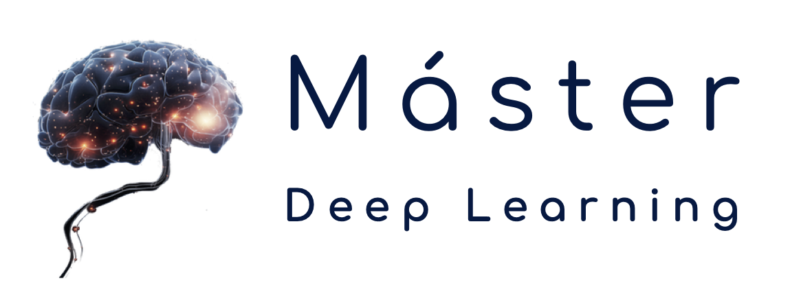
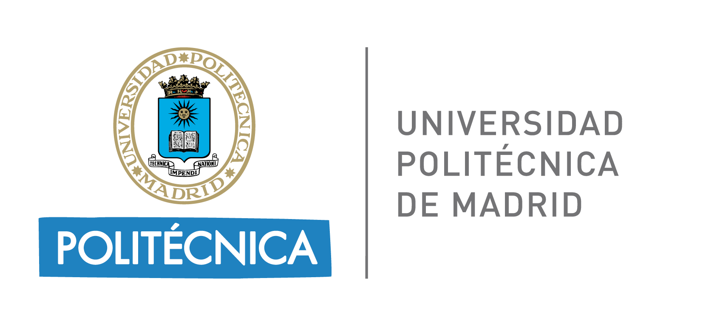

# Deep Learning para series temporales

---

[Español](#español) | [English](#english)

---
## Español
### Descripción
Material para el curso "Deep Learning para series temporales" (DLTEMP)
- Máster en Deep Learning UPM.
- Universidad Politécnica de Madrid.
- Curso 2024-25.

### Contenido
- `nbs`: Contiene cuadernos Jupyter con ejemplos prácticos sobre algoritmos enseñados en el curso.
- `exercises`: Incluye cuadernos Jupyter con ejercicios semanales.
- `slides`: Contiene las diapositivas del curso.

[Volver al índice](#índice)

---

## English
### Description
Material for the course "Deep Learning para series temporales" (DLTEMP)
- Master in Deep Learning UPM.
- Polytechnic University of Madrid.
- Course 2024-25.

### Content
- `nbs`: Contains Jupyter Notebooks with practical examples of algorithms taught in the course.
- `exercises`: Includes Jupyter Notebooks with weekly assignments.
- `slides`: Contains the course slides.

[Back to Index](#índice)
